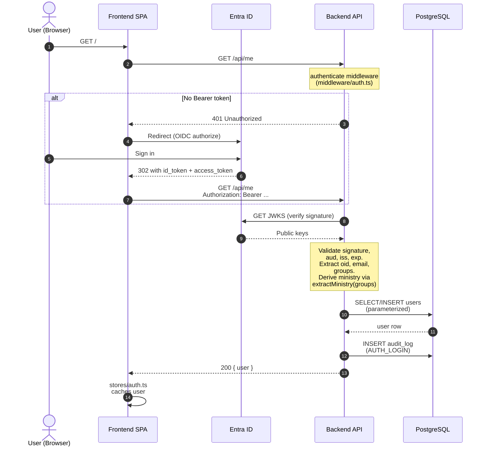
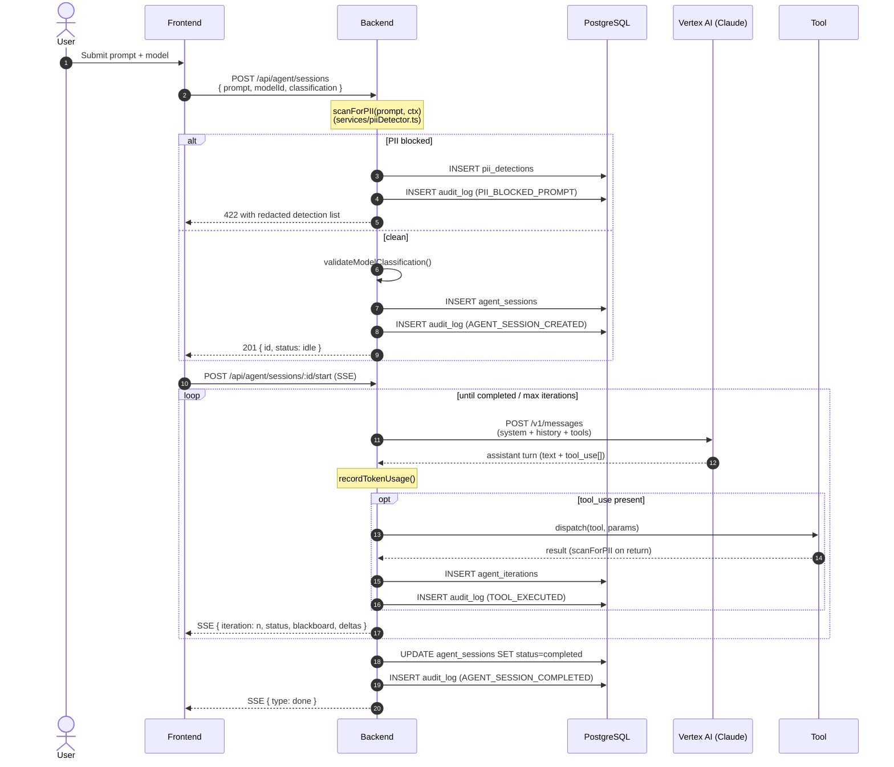
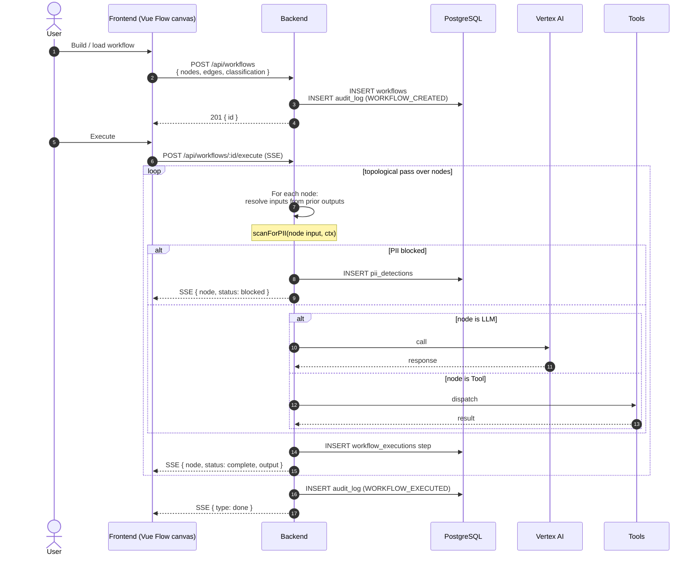
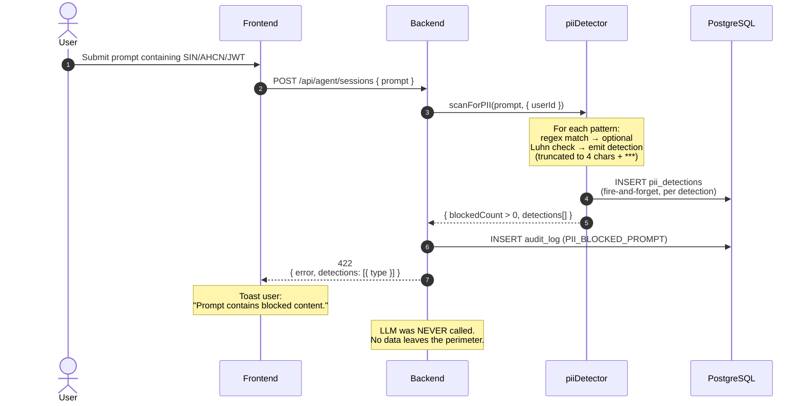

# Data Flow Diagrams

This document captures the four canonical data-flow paths through the ABC Agent Builder Console:

1. **User login** (Entra ID OIDC)
2. **Free Agent execution** (single-prompt agent loop)
3. **Workflow execution** (multi-step canvas)
4. **PII block path** (a prompt is rejected before it leaves the perimeter)

Each sequence cites the implementing files. Reviewers should be able to trace any data element from origin to rest by following the diagrams below in conjunction with `threat_model_stride.md` and `controls_matrix.md`.

---

## 1. User login (SSO)

**Implementation references**

- `backend/src/middleware/auth.ts` — `authenticate`, `extractMinistry`, `DEV_USER` mock
- `backend/src/services/auditLogger.ts` — `AuditAction.AUTH_LOGIN`
- `frontend/src/stores/auth.ts` — `loadUser()`
- Stream A delivers production JWT validation. Today, in `NODE_ENV=development`, the backend short-circuits to `DEV_USER`.

---

## 2. Free Agent execution

**Implementation references**

- `backend/src/routes/agent.ts:46` — `POST /sessions`
- `backend/src/services/piiDetector.ts:scanForPII`
- `backend/src/services/llmProvider.ts:streamLLM`, `recordTokenUsage`
- `backend/src/services/agentOrchestrator.ts:runOrchestrator`
- `backend/src/services/toolDispatcher.ts`

---

## 3. Workflow execution

**Implementation references**

- Stream C delivers the workflow executor; this diagram represents the agreed contract.
- Audit and PII scanning are reused from the Free Agent path — the same `scanForPII` and `auditAction` calls are wired in per node.

---

## 4. PII block path

**Implementation references**

- `backend/src/services/piiDetector.ts` — patterns, Luhn validation, `scanForPII`, `logDetections`
- `backend/src/routes/agent.ts:60-78` — block-and-return on `blockedCount > 0`
- `backend/src/services/auditLogger.ts:AuditAction.PII_BLOCKED_PROMPT`
- Truncation (`match.substring(0, 4) + "***"`) ensures raw matches never reach the DB, the response, or any log line.

---

## Cross-cutting properties

- **Every external egress is preceded by a PII scan.** This is the single chokepoint, enforced in `piiDetector.scanForPII` and called at all session-creation, continuation, interjection, and (in Stream C) per-workflow-node entry points.
- **All state-changing operations write an audit entry.** Audit failures never block the request (fire-and-forget).
- **All SSE streams clean up on client disconnect.** `req.on('close', stopSession)` ensures abandoned sessions stop their LLM loops.
- **All DB access is parameterized.** No `query()` call uses string concatenation for user input.
