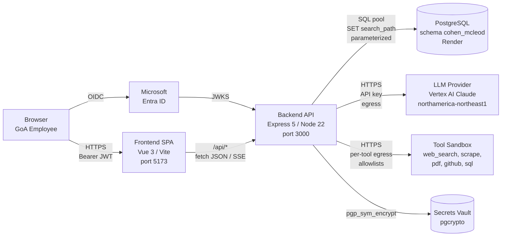

# Threat Model — STRIDE

**Application:** ABC Agent Builder Console
**Owner:** Government of Alberta — Cohen McLeod
**Document version:** 1.0 (Stream F initial)
**Last reviewed:** 2026-05-21

This document applies the STRIDE methodology to each architectural component of the ABC Agent Builder Console and maps each identified threat to the mitigating control in this codebase. Together with `data_flow_diagram.md` and `controls_matrix.md`, it forms the security half of the SOAR/STRA Authority-to-Operate package.

## Component diagram

## STRIDE table — Frontend SPA

| # | Threat (STRIDE category) | Description | Mitigation in this codebase |
|---|---|---|---|
| FE-S1 | **Spoofing** | Attacker bypasses SSO by injecting a forged user object into the SPA. | All identity is server-side. `stores/auth.ts` only mirrors `/api/me` — the backend's `authenticate` middleware is the source of truth. Frontend never reads tokens directly from the DOM or local storage. |
| FE-T1 | **Tampering** | Attacker modifies prompt or model selection in flight before submission. | Backend re-validates every request: `scanForPII`, classification check (`validateModelClassification`), prompt-length guard, zod schema on admin routes. Frontend hints are not trusted. |
| FE-R1 | **Repudiation** | User denies they triggered an action. | `auditLogger.ts` records `user_id`, `action`, `timestamp`, `ip_address` on every state-changing endpoint. Audit rows are append-only (no UPDATE/DELETE from app code). |
| FE-I1 | **Information disclosure** | XSS leaks tokens or PII shown in admin UI. | Helmet's `contentSecurityPolicy` in `backend/src/index.ts` restricts script sources to `'self'`. Vue's default text-binding escapes. PII matches are truncated at the source (`piiDetector.ts` line ~210) — raw values never reach the SPA. |
| FE-D1 | **Denial of service** | Malicious user spams admin tabs to overload the API. | Global rate limiter (500/15m) + per-endpoint `agentRateLimit` in `middleware/agentRateLimit.ts`. Admin endpoints inherit the global limit. |
| FE-E1 | **Elevation of privilege** | Non-admin user navigates to `/admin`. | Router guard in `frontend/src/router/index.ts` (`beforeEach`) checks `auth.isAdmin`. **Defence in depth:** backend `requireRole('admin')` rejects the API calls anyway (the router guard alone is not a security boundary — only a UX nicety). |

## STRIDE table — Backend API

| # | Threat | Description | Mitigation |
|---|---|---|---|
| BE-S1 | **Spoofing** | Forged JWT to access protected routes. | `authenticate` middleware validates JWT signature against Entra ID JWKS, audience, issuer, expiry. Stream A delivers production validation; dev mock is gated by `NODE_ENV === "development"`. |
| BE-T1 | **Tampering** | Path traversal, SQL injection, body injection. | `middleware/requestValidation.ts` blocks `../`, `%00`, SQLi keywords, JS-injection URL patterns. All DB access via parameterized `query<T>()` in `config/database.ts` — no string concatenation. Body size capped at 5 MB. |
| BE-R1 | **Repudiation** | Insider denies running a privileged action. | Admin routes are triple-guarded: `authenticate, requireRole('admin'), auditAdminAccess`. The third middleware writes an `ADMIN_ACCESS` audit entry before the handler runs. |
| BE-I1 | **Information disclosure** | Stack traces, env values, secret leakage. | Global error handler in `index.ts` strips `err.stack` in production. `env.ts` validates via Zod; secrets never echoed. Secrets vault uses `pgp_sym_encrypt` — plaintext never persisted. |
| BE-D1 | **DoS** | LLM cost exhaustion or runaway agent loops. | `MAX_ITERATIONS_LIMIT` + `MAX_CONCURRENT_SESSIONS` in env. Per-endpoint rate limiter. `loopDetector.ts` halts pathological loops. SSE connections close on client disconnect (req.on('close', stopSession)). |
| BE-E1 | **Elevation** | Tool execution escapes its sandbox to read host files. | Tools accept structured params only; no shell execution. `web_scrape` rejects private IPs in `requestValidation.ts`'s allowlist. Future SQL tool will require parameterized queries (Stream D). |

## STRIDE table — PostgreSQL

| # | Threat | Description | Mitigation |
|---|---|---|---|
| DB-S1 | **Spoofing** | Direct DB connection bypassing the app. | Connection string contains `sslmode=require`. Render's network policy restricts inbound to the application's egress IPs. Schema `cohen_mcleod` is scoped per `SET search_path` in `query()` — no cross-schema access. |
| DB-T1 | **Tampering** | Audit log tampering after the fact. | App layer writes only INSERTs to `audit_log` and `pii_detections`. UPDATEs happen exclusively via the retention job (anonymization, not deletion). Database role used by the app should not have `UPDATE`/`DELETE` on these tables — enforce in DB migration (operational hardening item). |
| DB-R1 | **Repudiation** | n/a — covered by audit log immutability above. | — |
| DB-I1 | **Information disclosure** | Backup leakage exposes plaintext user secrets. | `user_secrets.encrypted_value` is `pgp_sym_encrypt`-encrypted with `SECRETS_VAULT_KEY`. Backups contain only ciphertext. Plaintext only exists transiently in process memory at the moment of `getSecret()`. |
| DB-D1 | **DoS** | Slow query exhausts pool. | `SLOW_QUERY_THRESHOLD_MS = 1000` in `config/database.ts` logs slow queries. Pool capped at 15 connections. Per-query connection timeout 5s. |
| DB-E1 | **Elevation** | App-role user reads tables outside its schema. | `SET search_path TO cohen_mcleod, public` issued per query. The app DB user should have grants restricted to `cohen_mcleod` (operational enforcement). |

## STRIDE table — LLM Provider Egress

| # | Threat | Description | Mitigation |
|---|---|---|---|
| LLM-S1 | **Spoofing** | Compromised API key impersonates the app to the LLM. | Keys stored only in env (Render secret panel + Nexus secret references). Rotate annually per `docs/operations/key_rotation.md`. |
| LLM-T1 | **Tampering** | Prompt injection alters model behaviour to leak data. | Strict system-prompt template (`promptBuilder.ts`). Pre-flight PII scan (`scanForPII`) blocks credentials and IDs before the request leaves the perimeter. Classification gate (`validateModelClassification`) prevents Protected B data from reaching non-Canadian providers. |
| LLM-R1 | **Repudiation** | Vertex AI logs unavailable for forensics. | Every LLM call audited locally (`AGENT_ITERATION_COMPLETE` with token counts, model id, latency). Token usage tracked in `getTokenUsageStats()`. |
| LLM-I1 | **Information disclosure** | Sensitive data egresses to a non-Canadian region. | `model_registry.data_residency` + `max_classification` columns enforce Canadian residency for Protected B. Vertex AI region pinned to `northamerica-northeast1` via `VERTEX_AI_REGION` env. |
| LLM-D1 | **DoS** | LLM provider rate-limits us; agent stalls. | Exponential-backoff retry with cap in `llmProvider.ts:withRetry`. Streaming uses fewer retries (1). |
| LLM-E1 | **Elevation** | Model returns malicious tool call (e.g. SSRF). | `toolDispatcher.ts` rejects unknown tools and dispatches via typed registry. Tool implementations are written by us — model output cannot reach `eval` or shell. |

## STRIDE table — Tool Sandbox

| # | Threat | Description | Mitigation |
|---|---|---|---|
| T-S1 | **Spoofing** | `web_scrape` impersonates a real browser to bypass robots.txt. | Tool identifies as the GoA bot; **no browser spoofing** (non-negotiable per `AGENTS.md`). Honors robots.txt. |
| T-T1 | **Tampering** | Scraped content carries injected instructions back to the agent. | All tool results pass through `scanForPII` on the return path before being added to scratchpad. System prompt instructs the model to treat tool output as untrusted data. |
| T-R1 | **Repudiation** | n/a | `auditToolExecution` records every tool call with duration and success. |
| T-I1 | **Information disclosure** | API proxy leaks credentials. | Per-tool URL allowlists. Private IP blocking in `requestValidation.ts`. Bearer tokens read from `secretsVault` (Stream D integration point) — never from query strings. |
| T-D1 | **DoS** | Tool runs longer than the request budget. | `TOOL_TIMEOUT_MS = 30000` enforced by `toolDispatcher`. |
| T-E1 | **Elevation** | `database_query` tool runs arbitrary SQL. | Tool will run only with parameterized statements; connection strings allowlisted via env. Write operations require an explicit flag and admin approval (Stream D). |

## Top residual risks (carry into `pia.md` § Residual risks)

1. **Vault key in env** — `SECRETS_VAULT_KEY` lives alongside the DB password. Mitigated via fingerprint logging, 32-byte minimum, documented rotation. Cannot be fully resolved until KMS integration.
2. **Dev mock auth** — `authenticate` returns an admin user when `NODE_ENV === "development"` and no token is present. Production deploys must set `NODE_ENV=production`. Verified via deployment runbook smoke check.
3. **Audit log integrity** — Today, the app DB role is not constrained at the DB level from updating `audit_log`. Recommended hardening: separate `audit_writer` DB role with INSERT-only grant.
4. **Tool injection** — Adversarial scraped pages can still influence the agent's reasoning. Mitigation is the system prompt's discipline and the user's review of the blackboard; not eliminated.
